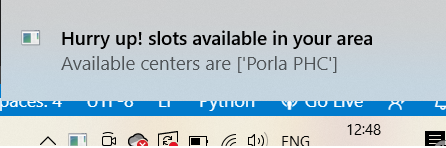

# cowin-slot-notifier

## What this application does?
The python script is executed periodically as per set frequency in the python scheduler and once the slot is available for mentioned age group in mentioned district/PIN code area, you will be notified through desktop notification message.

## Prerequisites
Python3.x should be installed on your machine. If it is not already installed then download it from [here](https://www.python.org/downloads/)

## Steps for installation
1. Clone the repo `git clone git@github.com:gayu19/cowin-slot-notifier.git`
2. Create a virtual environment with command `python -m venv env`
3. Mac users can activate the virtual environmnet with command `source env/bin/activate`, windows users can activate it with `source env/Scripts/activate`
4. Create `.env` file in same directory and add below environment variables.
5. Add your browser User-Agent in environment variables. `USERAGENT=<Your browser's User-Agent>`. You can get the value for browser's User-Agent from [here](https://www.whatismybrowser.com/detect/what-is-my-user-agent) 
6. Add the frequency of the script to be run in environment variables. `FREQUENCY=<frequency to run the script in seconds>`. For example, if you set that to `FREQUENCY=30`then the script will check the slot availability every thirty seconds.
7. Install Python dependencies `python -m pip install -r requirements.txt`.

## How to run the script?
1. If you want to findout the slots available for particular PIN code for minimum age limit 18 then you have to use the command `python excuter.py pin <your PIN code> 18`, for minimum age limit 45 the command will be `python excuter.py pin <your PIN code> 45`
2. If you want to findout the slots available in complete district then the command will be `python executer.py district <your state name> <your district name> 18`for minimum age limit 18 , and for minimum age limit 45 the command will be `python executer.py district <your state name> <your district name> 45`.
3. So while running the application you have to replace the PIN or state and district name as per your requirement in the command.

## Debugging
If you face any issue while running the script or you want to see the details of the available center that you can check in exec.log file. 

## Result
Once the slot is available in your intended area then you will get the notification as shown in below image.

